<div align="center">

# Echeance

Track token expiry and the renewal steps for each

[![Live][badge-site]][url-site]
[![HTML5][badge-html]][url-html]
[![CSS3][badge-css]][url-css]
[![JavaScript][badge-js]][url-js]
[![Claude Code][badge-claude]][url-claude]
[![License][badge-license]](LICENSE)

[badge-site]:    https://img.shields.io/badge/live_site-4f46e5?style=for-the-badge&logo=googlechrome&logoColor=white
[badge-html]:    https://img.shields.io/badge/HTML5-E34F26?style=for-the-badge&logo=html5&logoColor=white
[badge-css]:     https://img.shields.io/badge/CSS3-1572B6?style=for-the-badge&logo=css3&logoColor=white
[badge-js]:      https://img.shields.io/badge/JavaScript-F7DF1E?style=for-the-badge&logo=javascript&logoColor=black
[badge-claude]:  https://img.shields.io/badge/Claude_Code-CC785C?style=for-the-badge&logo=anthropic&logoColor=white
[badge-license]: https://img.shields.io/badge/license-MIT-404040?style=for-the-badge

[url-site]:   https://echeance.neorgon.com/
[url-html]:   #
[url-css]:    #
[url-js]:     #
[url-claude]: https://claude.ai/code

</div>

---

## Overview

Echeance keeps an inventory of credentials as one portable YAML document
(metadata only, never secret values) and renders it four ways: an urgency
board sorted by time left, a sortable table, a month calendar, and an `.ics`
export that puts real alarms in your real calendar. Beside the inventory sits
a library of renewal tutorials, the actual steps to obtain, renew and revoke
each kind of credential, published as [llms.txt](https://echeance.neorgon.com/llms.txt)
so agent sessions can reuse them instead of rediscovering them.

Everything runs in the browser. Nothing is uploaded anywhere.

**Live:** [echeance.neorgon.com](https://echeance.neorgon.com/)

---

## Features

- **YAML in, YAML out** -- the inventory is one document you edit, import and export; validation reports every problem at once
- **Expiry board** -- credentials grouped by urgency: expired, next 7 days, next 30 days, later, unknown, no expiry
- **Table and calendar** -- sortable columns with filtering, and a month grid with one chip per expiry
- **ICS export** -- one all-day event per dated credential with alarms at each lead time, so reminders fire without the site open
- **Browser notifications** -- opt-in nudges while the site is open, deduplicated per threshold
- **Renewed today** -- one click sets the created date and recomputes expiry from the credential's lifetime
- **Renewal tutorials** -- signals, steps, verification, revocation and hard-won insights per credential kind
- **llms.txt** -- the whole tutorial set as one plain-text file for agent sessions, generated from the same YAML the site renders

---

## Running locally

ES modules require an HTTP server (not `file://`):

```bash
make serve
```

Or manually:

```bash
python3 -m http.server 8875
```

An `inventory.local.yaml` at the project root (gitignored) loads automatically
when the browser has no saved inventory; without it the site falls back to
`data/sample.yaml`. After editing `data/tutorials.yaml`, regenerate llms.txt:

```bash
make llms
```

---

## Architecture



```
echeance-site/
├── index.html            # HTML shell: five views, credential modal
├── llms.txt              # GENERATED from data/tutorials.yaml (make llms)
├── css/
│   └── style.css         # Board, table, calendar, tutorial and YAML styles
├── js/
│   ├── app.js            # Entry point, loads data and renders
│   ├── state.js          # Inventory + tutorial state, localStorage, load order
│   ├── yaml-io.js        # Parse, validate, serialize the inventory document
│   ├── render.js         # Board, table, credential modal, view switching
│   ├── calendar.js       # Month grid
│   ├── tutorials.js      # Tutorial list and detail
│   ├── ics.js            # VCALENDAR builder (events + alarms)
│   ├── notify.js         # Browser notifications with dedup
│   ├── events.js         # All listeners; URL hash drives navigation
│   └── utils.js          # Dates, severity, escaping, toast, download
├── data/
│   ├── sample.yaml       # Dummy inventory shipped publicly
│   └── tutorials.yaml    # Renewal tutorials: the single source for llms.txt
├── scripts/
│   └── build-llms.py     # tutorials.yaml -> llms.txt
├── robots.txt
├── sitemap.xml
├── CNAME
├── Makefile              # serve, kill, llms
└── README.md
```

The real inventory never enters the repo: it lives in the visitor's browser
(localStorage) or in a gitignored `inventory.local.yaml` on the owner's
machine. The repo ships only dummy sample data and the tutorials.

---

<div align="center">
<sub>Part of <a href="https://neorgon.com/">Neorgon</a></sub>
</div>
